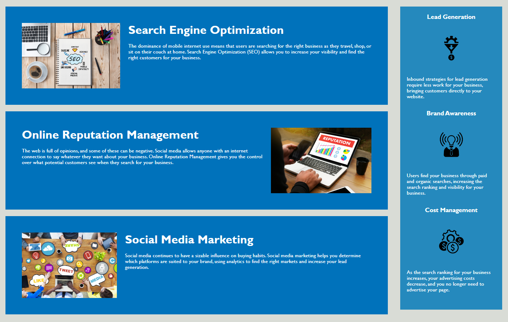

# code-refactor

## Description

This project was improved for more accessibility. However, I also made the structure of the CSS stylesheet more chronological as well as fixing the links. The code has been improved to make it more accessible by adding alt text and using an HTML semantic field. I learned that making a clearer structure helps a lot in knowing where each part of the website is, making it easier to make changes and understand the basics of what a website needs.

## Installation

N/A

## Usage

This was made it be used by the company Horiseon as their homepage. It includes information on what is needed to manage their business online and how they could help, advertising their work for others to use. 

Each article can be navigated by using the header.

The article has points on what they help with and the definitions of each so the customer can understand it better. The article on the side has the pros of working with them.

## Credits

N/A

## License

MIT License

Copyright (c) 2023 adahollins

Permission is hereby granted, free of charge, to any person obtaining a copy
of this software and associated documentation files (the "Software"), to deal
in the Software without restriction, including without limitation the rights
to use, copy, modify, merge, publish, distribute, sublicense, and/or sell
copies of the Software, and to permit persons to whom the Software is
furnished to do so, subject to the following conditions:

The above copyright notice and this permission notice shall be included in all
copies or substantial portions of the Software.

THE SOFTWARE IS PROVIDED "AS IS", WITHOUT WARRANTY OF ANY KIND, EXPRESS OR
IMPLIED, INCLUDING BUT NOT LIMITED TO THE WARRANTIES OF MERCHANTABILITY,
FITNESS FOR A PARTICULAR PURPOSE AND NONINFRINGEMENT. IN NO EVENT SHALL THE
AUTHORS OR COPYRIGHT HOLDERS BE LIABLE FOR ANY CLAIM, DAMAGES OR OTHER
LIABILITY, WHETHER IN AN ACTION OF CONTRACT, TORT OR OTHERWISE, ARISING FROM,
OUT OF OR IN CONNECTION WITH THE SOFTWARE OR THE USE OR OTHER DEALINGS IN THE
SOFTWARE.